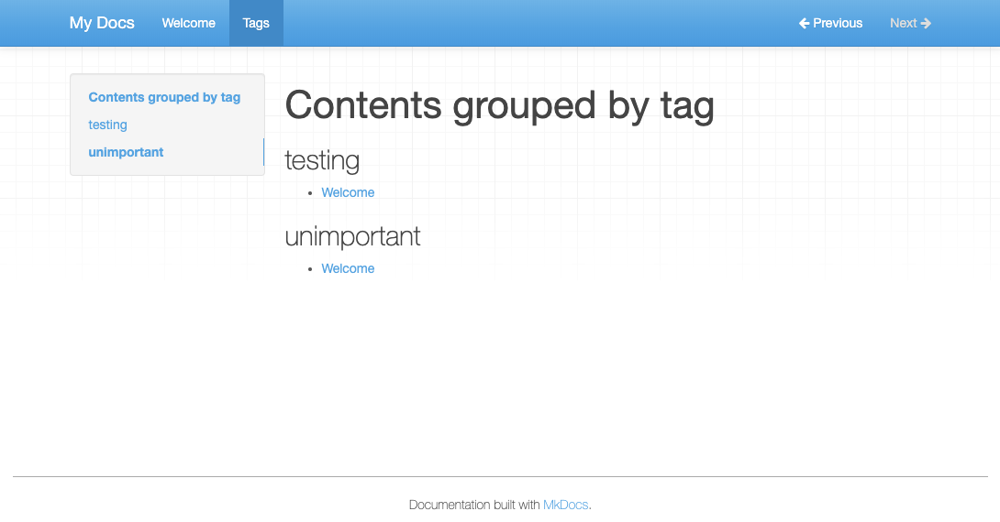

# vexy-mkdocs-tags

Add `tags: [python, cli]` to a page's front matter. A Tags page appears, listing every page under each tag.

This MkDocs plugin scans the YAML header of each Markdown file, collects the `tags`, and generates one index page grouping pages by tag. Theme-agnostic, no JavaScript, plain Markdown output.

## Visual


## Quick start

```shell
pip install vexy-mkdocs-tags
```

Enable it in `mkdocs.yml`:

```yaml
plugins:
  - search
  - tags
```

Tag any page:

```markdown
---
title: Getting started
tags:
  - intro
  - python
---
# Getting started
```

Run `mkdocs serve`. A `/tags` page appears in the nav, grouping pages by tag.



## What it generates

On each build the plugin writes a Markdown file — `aux/tags.md` by default — that MkDocs renders like any other page:

```markdown
# Contents grouped by tag

## <span class="tag">intro</span>
  * [Getting started](getting-started.md)

## <span class="tag">python</span>
  * [Getting started](getting-started.md)
```

Tags sort case-insensitively; pages under each tag sort by title, so the output is stable across builds. The file lives outside `docs/` so writing it never retriggers `mkdocs serve`. Style the `h2.tag` element with CSS to taste.

## Options

| Option | Default | What it does |
|---|---|---|
| `tags_filename` | `tags.md` | Name of the generated file. |
| `tags_folder` | `aux` | Where the file is written. Relative paths resolve beside `docs/`; absolute paths work too. Missing folders are created. |
| `tags_template` | *(built-in)* | Path to your own Markdown + Jinja2 template. Omit to use the packaged one. |

```yaml
plugins:
  - search
  - tags:
      tags_folder: /tmp/mysite/aux
      tags_template: docs/theme/tags.md.template
```

## Custom template

The template is Markdown with embedded Jinja2. It receives `tags`, a list of `(tag, pages)` pairs. Each `page` carries all of its front matter plus a `.filename` attribute (source path relative to `docs/`). A `slugify` filter is available for building anchors. The packaged default:

```markdown
---
title: Tags
---
# Contents grouped by tag



## <span class="tag">{{tag}}</span>

  * [{{page.title}}]({{page.filename}})



```

## Versus Material's built-in tags

MkDocs Material ships its own `tags` plugin that renders inline tag chips on each page and requires the Material theme. `vexy-mkdocs-tags` is theme-agnostic and produces one plain-Markdown index instead — useful off Material, or when you want a single grep-friendly list of every tag. The two use the same `tags:` front-matter key, so migrating in either direction costs nothing.

## Development

```shell
uv venv && source .venv/bin/activate
uv pip install -e ".[dev]"
pytest            # unit + real mkdocs build integration test
ruff check src tests
mypy src
```

## Credits

Originally `tags-macros-plugin` by JL Diaz (MIT). Repackaged and modernized as `vexy-mkdocs-tags`.

## License

MIT — see [LICENSE.md](LICENSE.md).
